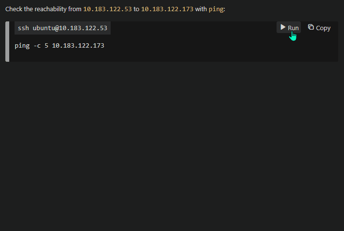
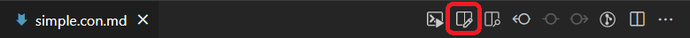
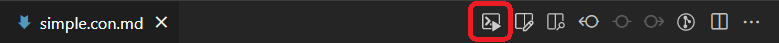
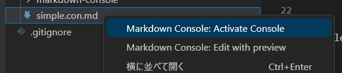

# Markdown Console

[](https://marketplace.visualstudio.com/items?itemName=negokaz.markdown-console)

半自動化のためのドキュメンテーションツール



## Motivation

サービスの安定稼働には、プロダクション環境での運用作業によるミスを最小限に抑えることが重要です。
すべての運用作業が完全に自動化され、十分に検証されていれば理想的ですが、そもそも自動化されていなかったり、自動化された内容に不備があるかもしれません。

運用作業を**半自動化**することで手作業につきまとうヒューマンエラーのリスクを減らせます。
各作業がうまくいったか人が確認しながら作業を進められるため、問題があった場合でもすぐに気づいて対処できます。

## Features

- Markdown に実行可能なコードブロックを追加できます
- 実行後の履歴を HTML ファイルにエクスポートできます

## Install

1. [Visual Studio Code](https://code.visualstudio.com/) をインストール
2. Visual Studio Code の[マーケットプレイスからインストール](https://marketplace.visualstudio.com/items?itemName=negokaz.markdown-console)

## Usage

`.con.md` という拡張子のファイルを作成し、次のボタンを押下すると、プレビューが表示されます。



実行可能なコードブロックは次のように記述します。

```bash
#@cmd:[bash -c]
echo "Hello, World!"
```

1行目の `@cmd` でインタプリタを指定します。
`@cmd` よりも前にある文字列は無視されるため、言語に応じたコメント開始記号を記述してコメントアウトできます。
コードブロックの内容は、インタプリタの最後の引数に指定されます。
上記の例では、実際には `bash -c 'echo "Hello, World!"'` が実行されます。

コードブロックを実行可能にするには次のボタンを押下します。

 

この他にも、コードブロックを標準入力からインタプリタに渡したり、Markdown に任意の変数を埋め込んだりもできます。
詳細は [リファレンスガイド](docs/ja/reference-guide.md) を参照してください。

すでに作成済みの `*.con.md` ファイルがある場合は、
次のボタンを押下することで、コードブロックが実行可能な状態の Console View を直接開けます。



または、コンテキストメニューから次の項目を選択することでも実行可能な Console View を開けます。



## LICENSE

Copyright (c) 2023 Kazuki Negoro

Markdown Console is released under the [MIT License](./LICENSE)
