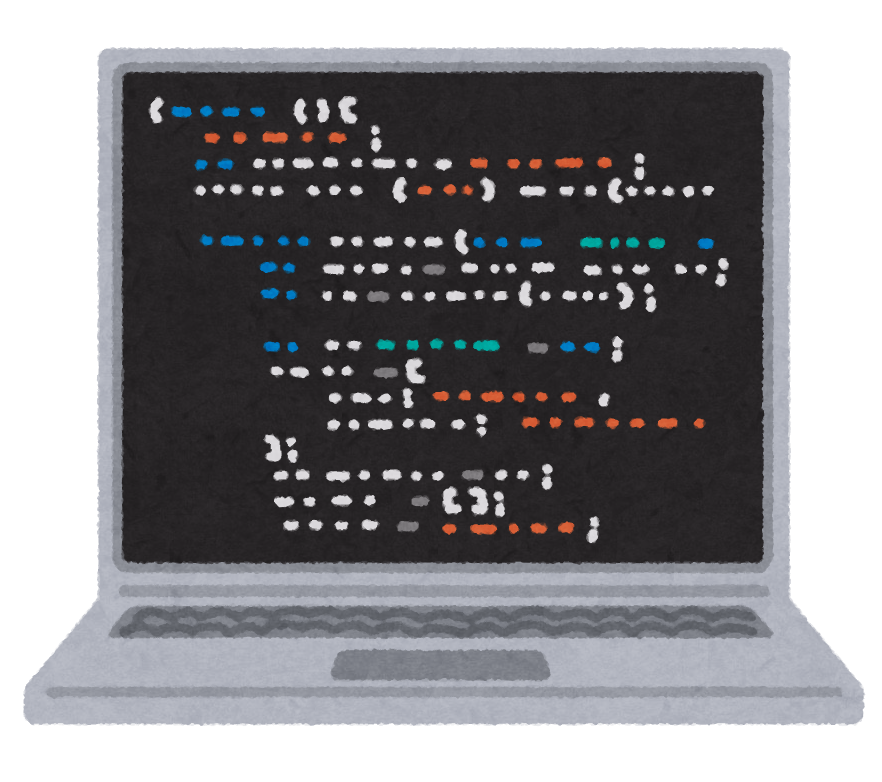

# Markdown 記法

## 見出し

```
# h1 見出し
## h2 見出し
### h3 見出し
#### h4 見出し
##### h5 見出し
###### h6 見出し
```


## コード

### インライン

インラインコード `code`

### ブロック（プレーンテキスト）

```
Sample code/text here...
```

### ブロック（シンタックスハイライト）

```js
function main() {
    console.log('Hello world!');
}
```

## 水平線

---
---

## 強調

**これは太字です**

*これはイタリック体の文字です*

~~取り消し線~~

## 引用

> `>` を行頭につけると引用になります
> > `>` を重ねることで
> > > インデントできます

## 箇条書き

+ リストを作るには `+` か `-` もしくは `*` を行頭に入れます
+ インデントをつけるとサブリストになります
    * いろはにほへと
    + ちりぬるを
    - わかよたれそ

## 順番付きの箇条書き

1. いちばんめ
2. にばんめ
3. さんばんめ

## 表

| name  | age |
| ------- | -- |
| Alice   | 11 |
| Bob     | 12 |
| Charlie | 13 |

## リンク

### ローカルファイル

- [タイトル無しリンク](./)
- [タイトル無しリンク](./test.con.md)
- [タイトル付きリンク](./basics.md "基本的な使い方")

### 外部 URL

- [タイトル無しリンク](http://example.com)
- [タイトル付きリンク](http://example.com "タイトルの例")
- 自動リンク: http://example.com


## 画像

### ローカルファイル



### 外部 URL


# スニペット

## オプションなし

```bash
#@cmd:[bash -c]
while read i
do 
    echo "${i}"
    sleep 0.1
done < <(seq 20)
```

## stdin 有効

```bash
#@cmd:[bash] stdin: true
echo 'Hello, World!'
```

## tty 有効

```bash
#@cmd:[bash -c] tty: true
read -p 'Name?' -s input
echo
echo "Hello, ${input}!"
```

## 文字コード指定

```powershell
#@cmd:[powershell -Command] encoding: cp932
echo 'テスト'
```

## カラー表示

```bash
#@cmd:[bash -c]
curl -s https://gist.githubusercontent.com/HaleTom/89ffe32783f89f403bba96bd7bcd1263/raw/e50a28ec54188d2413518788de6c6367ffcea4f7/print256colours.sh | bash
```

## 定義エラー

```bash
#@cmd:[bash -c
ls
```

## コマンドなしエラー

```bash
#@cmd:[unknown-command -a fizz]
ls
```

## 独自環境変数

```bash
#@cmd:[bash -c]
set -ex
# ドキュメントがあるディレクトリの絶対パス
printenv MDCON_WORKING_DIR
# 設定ファイルがない場合、MDCON_WORKING_DIR と同一
printenv MDCON_BASE_DIR
```
